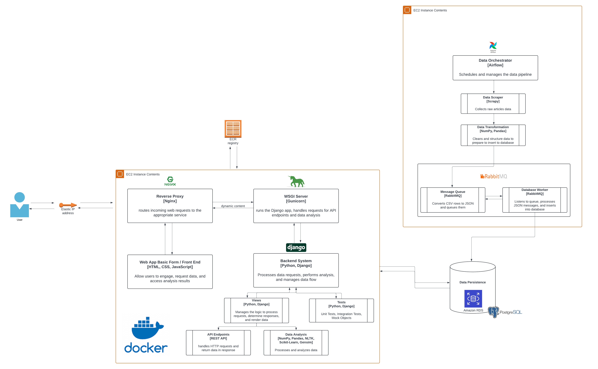

<h2 align="center">NLP Text Mining Dashboard Web app</h2>
<br>

For full implementation and report, please refer to the file: report.pdf

<p>Teas.cafe is a dynamic, interactive, nlp dashboard that provides insights into software engineering and data science articles. 
Designed to explore trends and reader interests in these fields, the dashboard presents exploratory data analysis and text mining visualizations. 
Users can uncover patterns, popular topics, and article types that resonate most with audiences, making it a valuable tool for understanding content trends in tech and data science.</p>

# Project Demo
Live demo: https://teas.cafe
<br/>
<br/>

# Architecture    


<b>High-Level Architecture of the system:</b>
* <b>Data Collection:</b>
    - An Airflow orchestrator is responsible for scheduling and running the tasks here
    - The first step is by scraping publicly available archive from the most popular tech publishers on Medium.com
    - The next step is to transform and clean the data to fit the schema in PostgreSQL
    - The data is then inserted to a <b>message queue</b> with RabbitMQ, which will store every row as a JSON queue
    - The Database Worker fetch the data from the queue and insert them into PostgreSQL
* <b>Data Persistence:</b>
    - Data is saved from the data collection step into a PostgreSQL database
* <b>Backend System:</b>
    - The backend system is written in Python using the Django framework, which includes: 
        * <b>RESTful API endpoints</b> to accept GET requests from Frontend
        * <b>Data analysis</b> by querying the database from PostgreSQL and analyzing the data using data analysis and nlp libraries, such as NumPy, Pandas, NLTK, etc.
        * <b>Testing</b> includes unit tests, integration tests, and using mocks to test sample data
* <b>Web App Basic Form / Frontend:</b>
    - The frontend is written in HTML, CSS, and JavaScript. Javascript is used to fetch data from the backend API endpoints and charts are visualized with Chart.js
* <b>Product Environment:</b>
    - The app is containerized with Docker, with Gunicorn serving as the WSGI HTTP server and Nginx acting as a reverse proxy to handle incoming web traffic and distribute it to the application
    - The app is deployed on AWS running the following services:
        * AWS Elastic IP for static IP address
        * AWS EC2 running web app in Docker container
        * AWS ECR where the Docker images are stored
        * AWS RDS PostgreSQL running the PostgreSQL database
<br/>
<br/>

# Getting Started (Non-Production Environment)
Please make sure you have Postgres installed in your local computer before your start the following steps

You can set up the database following the Airflow steps in the report.pdf or use the backup.dump

Set up your Postgres Database:
```bash
pg_restore -U <your_username> -h localhost -d new_database_name -v /path/to/backup.dump
```

Navigate into the project's directory:
```bash
cd nlp_dashboard/nlp_dashboard
```

Comment or delete the following lines in settings.py as this is for production only:
```bash
DEFAULT_AUTO_FIELD = "django.db.models.BigAutoField"

SECURE_PROXY_SSL_HEADER = ("HTTP_X_FORWARDED_PROTO", "https")

CSRF_TRUSTED_ORIGINS = os.environ.get("CSRF_TRUSTED_ORIGINS").split(" ")
```

Create a .env file and include the following information:
```bash
DEBUG=1 # leave as is
SECRET_KEY = 'insert-a-secret-key-here-can-be-anything' # you can leave as is or change to your preference
DJANGO_ALLOWED_HOSTS=localhost,0.0.0.0,127.0.0.1 # leave as is

SQL_ENGINE = 'django.db.backends.postgresql' # leave as is
SQL_NAME = 'db-name-you-set-up-earlier'
SQL_USER = 'your-postgres-username'
SQL_PASSWORD = 'your-postgres-password'
SQL_HOST = 'localhost' # leave as is
SQL_PORT = '5432' # leave as is
DATABASE = 'postgres' # leave as is
```

Create and activate your virtual environment, install dependencies, and run

```bash
python -m venv venv_name
pip install -r requirements.txt
source venv_name/bin/activate

# inspect the database, copy the models over to models.py
python manage.py inspectdb
python manage.py makemigrations
python manage.py migrate
python manage.py runserver
```
